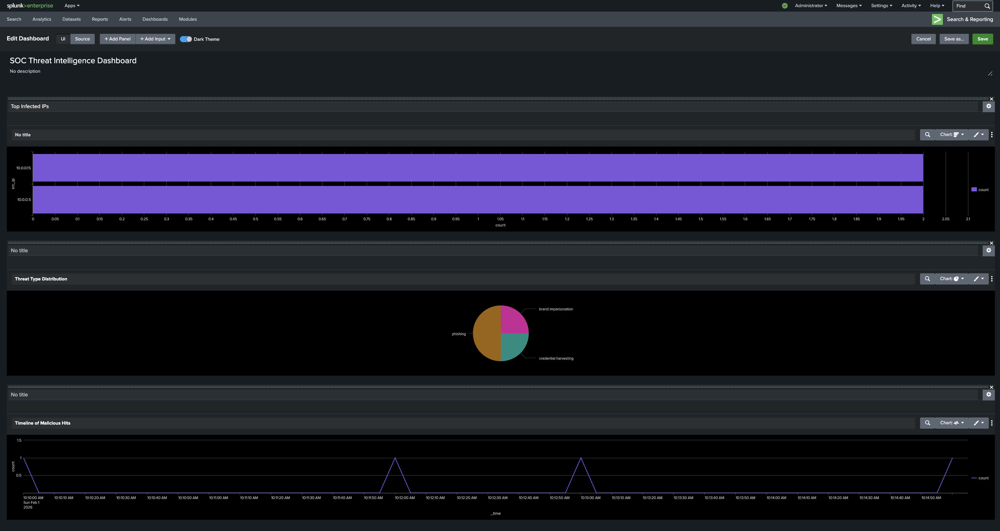
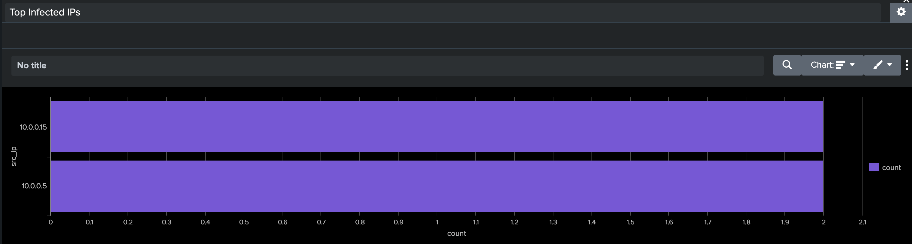
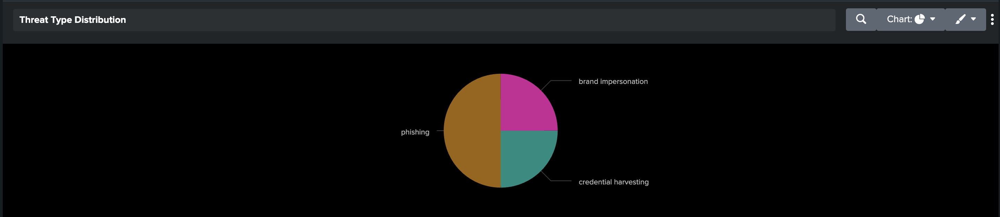

# SOC-Threat-Intelligence-Triage-Lab

SOC Threat Intelligence Enrichment and Triage Simulation using Splunk

This lab simulates a SOC workflow for analyzing proxy logs and matching them against a threat intelligence feed to flag interactions with known malicious domains.

Lab Workflow:

1️⃣ Threat Intelligence Lookup Integration
- Created Splunk indexes for proxy logs and threat intelligence feeds
- Built lookup tables to enrich proxy logs with threat_type and confidence
- Correlated logs to identify malicious hits:

index=proxy_logs | lookup threat_lookup domain OUTPUT threat_type confidence | search threat_type=*

2️⃣ Infected IP Detection
- Identified internal hosts interacting with malicious domains
- Prioritized high-confidence alerts:

| stats count by src_ip | sort -count

3️⃣ Dashboard Visualization
- Top Infected IPs Panel
- Threat Type Distribution Panel
- Timeline of Malicious Hits Panel

Key Outcomes
- Built threat intelligence enrichment workflow
- Created detection logic for malicious domains
- Identified and triaged infected internal hosts
- Simulated a realistic SOC workflow from raw logs to actionable insights

GitHub Repository Contents:
- lookups/ → Threat feeds CSV
- queries/ → SPL queries used for detection and triage
- sample_data/ → Proxy log samples
- screenshots/ → Dashboard images for visualization
- docs/ → Detection logic & incident response workflow

Full project available here: https://github.com/yourusername/SOC-Threat-Intelligence-Triage-Lab

## Dashboard Overview

## Top Infected IPs Panel

## Threat Distribution Panel

## Timeline Panel

